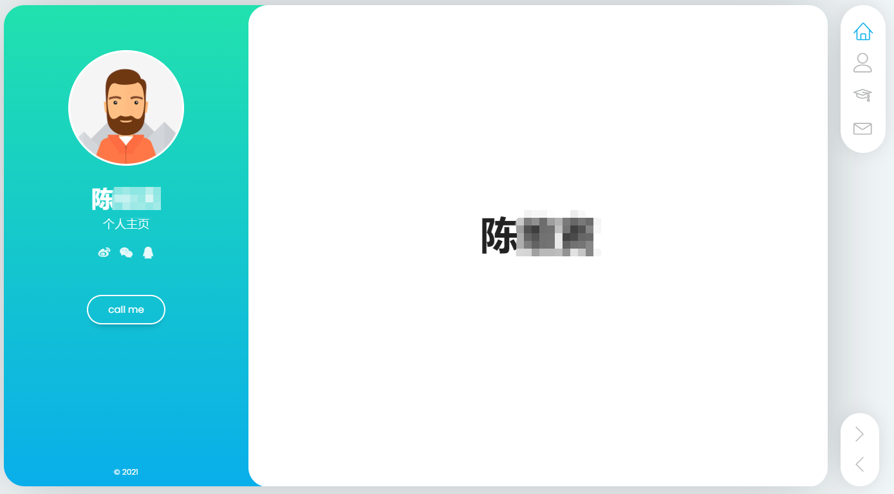
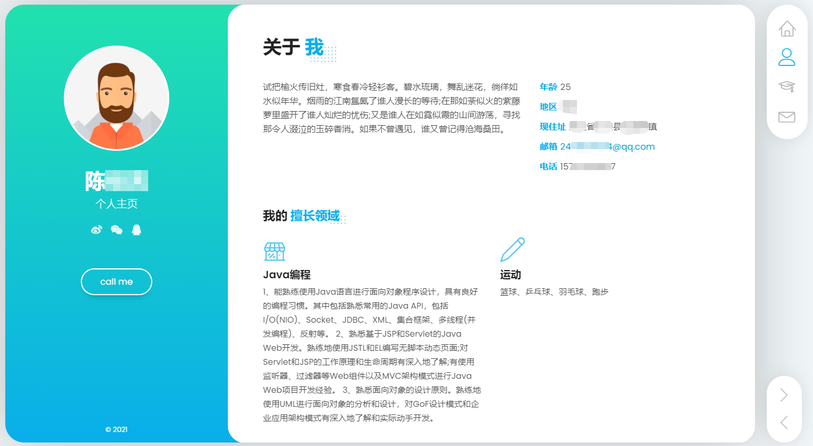
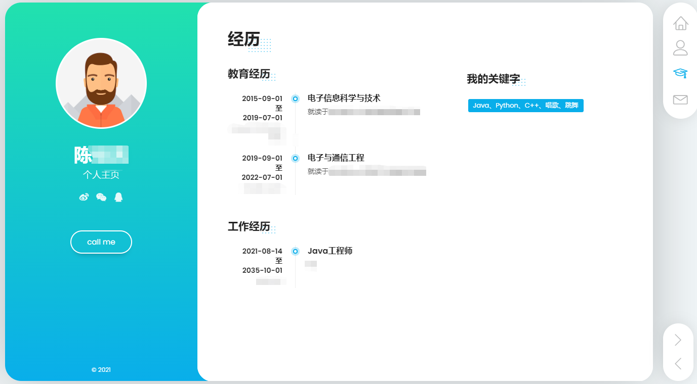

### 任务名称：个人主页项目

### 任务背景

* 程序员求职现状

    * 项目经验少，企业觉得不靠谱
    * 无真实部署上线可用项目，企业认为有较高培养成本
    * 对新的生态技术不了解
    * 简历平平，不亮眼。

* 企业用人现状

    * 招人难，人才难遇

    * 招到的人简历造假，上手就废

    * 招到的人不能立马干活，需要较高培养成本

    * 招到的人技术落后，编写的程序代码落后七八年

    * 现在都在用devops，要求开发人员懂测试和运维。普遍程序员不懂。

### 任务收获

* 一个上线的项目经历

    * 云服务怎么用
    * 数据库云集群怎么搭建
    * 项目怎么部署
    * 怎么为上线项目做全球1800个数据处理中心的加速

* 效果外化的亮点

    * 体现在云方向的技术新颖，爱学习有沉淀的小伙子/小姑娘
    * 爱学习的人，实力不会太差，且值得培养
    * 拥有上线项目，面试官感知：试错成本少。
    * 亮眼视觉效果的个人主页
    * 可以用自己的成果带朋友一起生成个人主页
    * 成果预览：

    
    
    
    
    
### 任务拆解

* #### 子任务一：项目部署与云服务搭建
```
    * 任务完成标准：提交个人主页访问地址
```

* #### 子任务二：项目加速和公众号上线
```
    * 任务完成标准：提交个人公众号名称
```

* #### 子任务三：编码从0到1
```
    * 任务完成标准：提交本地运行截图
```

### 阿里云ECS服务器搭建流程

https://shimo.im/docs/VKSf7sSV5ooAHXoW

### PolarDB使用流程

https://shimo.im/docs/FcBDQTnX8j0deThh

### 宝塔页面安装MySql及使用流程

https://shimo.im/docs/dJ15QDzaEYAA6w27


# 个人主页项目接口文档

```
baseUrl: 
```

## 接口列表：

### 1、新增用户基本信息

#### 请求URL:  

```
http://域名/v1/user/insert
由于没有域名，就直接用网址代替了
http://47.94.84.49/v1/user/insert
```

#### 请求方式: 

```
post
```

#### 参数类型：param

| 参数        | 是否必选 | 类型   | 说明     |
| :---------- | :------: | :----- | :------- |
| name        |    Y     | string | 姓名     |
| age         |    Y     | int    | 年龄     |
| city        |    Y     | string | 城市     |
| address     |    Y     | string | 详细地址 |
| email       |    Y     | string | 邮箱地址 |
| phone       |    Y     | string | 手机号码 |
| weixin      |    Y     | string | 微信号码 |
| qq          |    Y     | string | qq号码   |
| weibo       |    Y     | string | 微博地址 |
| description |    Y     | string | 个人简介 |

#### 返回示例：

{
  status:0,//状态码，0表示正常，-1表示错误
  msg:"用户新增成功",//返回的消息
  data:1//本次新增的用户编号，用于新增其他信息的userid参数
}

### 2、新增用户的特长信息

#### 请求URL:  

```
http://47.94.84.49/v1/specialty/insert
```

#### 请求方式: 

```
post
```

#### 参数类型：param

| 参数        | 是否必选 | 类型   | 说明                                 |
| :---------- | :------: | :----- | :----------------------------------- |
| userId      |    Y     | int    | 用户编号，表明给某个用户新增学历信息 |
| name        |    Y     | string | 特长名称                             |
| description |    Y     | string | 学历简介                             |

#### 返回示例：

```javascript
{
  status:0,//状态码，0表示正常，-1表示错误
  msg:"新增成功"//返回的消息
}
```


### 3、新增用户的学历经历

#### 请求URL:  

```
http://47.94.84.49/v1/edu/insert
```

#### 请求方式: 

```
post
```

#### 参数类型：param

| 参数        | 是否必选 | 类型   | 说明                                 |
| :---------- | :------: | :----- | :----------------------------------- |
| userId      |    Y     | int    | 用户编号，表明给某个用户新增学历信息 |
| start       |    Y     | string | 学历开始时间                         |
| end         |    Y     | string | 学历结束时间                         |
| school      |    Y     | string | 学校名称                             |
| study       |    Y     | string | 学科名称                             |
| description |    Y     | string | 学历简介                             |

#### 返回示例：

```javascript
{
  status:0,//状态码，0表示正常，-1表示错误
  msg:"新增成功"//返回的消息
}
```

### 4、新增用户工作经历信息

#### 请求URL:  

```
http://47.94.84.49/v1/work/insert
```

#### 请求方式: 

```
post
```

#### 参数类型：param

| 参数        | 是否必选 | 类型   | 说明                                 |
| :---------- | :------: | :----- | :----------------------------------- |
| userid      |    Y     | string | 用户编号，表明给某个用户新增工作信息 |
| start       |    Y     | int    | 工作经历开始时间                     |
| end         |    Y     | string | 工作经历结束时间                     |
| company     |    Y     | string | 公司名称                             |
| job         |    Y     | string | 岗位名称                             |
| description |    Y     | string | 工作经历简介                         |

#### 返回示例：
```javascript
{
  status:0,//状态码，0表示正常，-1表示错误
  msg:"新增成功"//返回的消息
}
```

### 5、新增用户技能列表

#### 请求URL:  

```
http://47.94.84.49/v1/skill/insert
```

#### 请求方式: 

```
post
```

#### 参数类型：param

| 参数     | 是否必选 | 类型   | 说明                                 |
| :------- | :------: | :----- | :----------------------------------- |
| userid   |    Y     | string | 用户编号，表明给某个用户新增技能列表 |
| Keywords |    Y     | string | 技能列表，多个技能使用空格隔开       |

#### 返回示例：
```javascript
{
  status:0,//状态码，0表示正常，-1表示错误
  msg:"新增成功"//返回的消息
}
```


### 6、获取用户简历信息

#### 请求URL：

```
http://47.94.84.49/v1/info
```

#### 示例：

[http://47.94.84.49/v1/info?userId=1](http://47.94.84.49/v1/info?userId=1)

#### 请求方式：

```
GET
```

#### 参数类型：query

| 参数   | 是否必选 | 类型 | 说明   |
| :----- | :------: | :--- | :----- |
| userId |    Y     | int  | 用户id |

#### 返回示例：
```javascript
{
  "data": {
    "edu": {
      "description": "测试测试测试",
      "end": "0444-05-05",
      "id": 19,
      "next": {
        "description": "锄禾日当午",
        "end": "0222-02-03",
        "id": 20,
        "next": {
          "description": "测试测试",
          "end": "0022-02-02",
          "id": 21,
          "school": "北京大学",
          "start": "0011-02-01",
          "study": "专业内容1",
          "userId": 19
        },
        "school": "上海某大学",
        "start": "0111-11-01",
        "study": "12313",
        "userId": 19
      },
      "school": "北京某大学",
      "start": "0444-04-04",
      "study": "学习专业",
      "userId": 19
    },
    "skill": {
      "id": 7,
      "keyWords": "1 2 3 5 6 7 8 9 0 1",
      "userId": 19
    },
    "specialty": {
      "description": "111111111111111111111111111111111111111111111111111111111111111111111111111111111111111111",
      "id": 14,
      "name": "11111",
      "next": {
        "description": "222222222222222222222222222222222222222222222222222222222222222222222222222222222222222222",
        "id": 13,
        "name": "222222",
        "userId": 19
      },
      "userId": 19
    },
    "user": {
      "address": "海淀区xxx",
      "age": 19,
      "city": "北京",
      "description": "chuheridangwu",
      "email": "1@qq.com",
      "id": 19,
      "name": "崔老师",
      "phone": "13141223336",
      "qq": "1532564",
      "sex": "",
      "weibo": "https://www.baidu.com",
      "weixin": "1354"
    },
    "work": {
      "company": "品嘻嘻",
      "description": "找女朋友",
      "end": "2021-11-11",
      "id": 16,
      "job": "Java",
      "next": {
        "company": "tengxun",
        "description": "chuheridangwu",
        "end": "2014-01-01",
        "id": 17,
        "job": "java",
        "next": {
          "company": "alibaba",
          "description": "alibabahahaha",
          "end": "2011-01-01",
          "id": 15,
          "job": "java",
          "start": "2010-01-01",
          "userId": 19
        },
        "start": "2013-01-01",
        "userId": 19
      },
      "start": "2013-11-11",
      "userId": 19
    }
  },
  "msg": "查询成功",
  "status": 0
}
```

